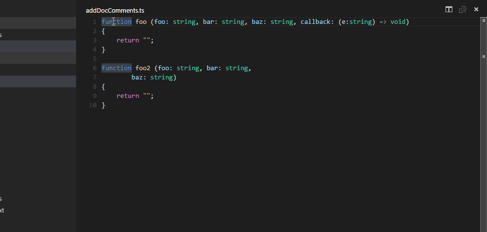

# vscode-comment
Adds simple jsdoc comments for the parameters of a selected function signature

## Using
In a typescript or javascript  file, select a function signature, ideally one that contains one or more parameters. Select the whole function signature then invoke the Add Doc Comments extension (open the command palette (F1 on Windows) and look for the command 'Add doc comments'. Hit enter.)

The extension will parse the selected signature and add @param and @return tags for each parameter and any return type in the selected signature, directly above the signature.

## Limitations
The extension does not support any other type of jsdoc tags. It only calculates @param and @return

Parameter types are not inferred based on usage. If a type is not specified, the type {any} is output.
